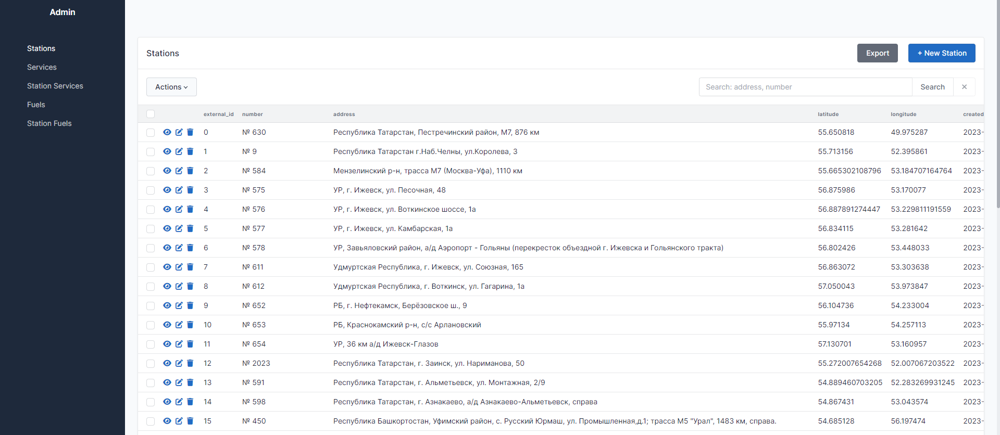

## О проекте

Проект является тестовым заданием. Реализует возможность агрегировать в себе данные с нескольких источников, являясь
неким прокси для клиентов.

## Задание

#### Дано:

В Сети существует несколько Источников, предоставляющих различные данные; Существуют Клиенты (приложения, сервисы),
которые должны получать информацию с этих источников.

#### Задача:

Разработать Сервер-посредник, который будет собирать информацию с Источников, объединять/модифицировать/кэшировать
данные и отдавать Клиентам по запросу.

#### Требуется:

1. Описать схему API для Сервера-посредника для взаимодействия с Клиентами.
2. Описать общую схему работы Сервера-посредника, взаимодействие с Источниками и Клиентами, составить примерный список
   необходимых для реализации инструментов и библиотек.

#### Описание Источников:

#### Источник №1

Возвращает список АЗС содержащий следующую информацию по каждой из АЗС:

- Id
- Координаты
- Номер
- Адрес
- Список URL изображений
- Список дополнительных услуг

Информация меняется примерно раз в два дня.

#### Источник №2

Возвращает список АЗС содержащий следующую информацию по каждой из АЗС:

- Id
- Список цен на топливо, каждый элемент которого состоит из:
- Название топлива
- Цена топлива
- Валюта цены топлива

Информация меняется примерно два-три раза в сутки в произвольное время. Сервер-посредник по запросу возвращает Клиентам
список АЗС, содержащий объединённые с обоих Источников данные.

У Сервера-посредника должна быть возможность через административный интерфейс

- указать иконки для каждого вида топлива и для каждого вида дополнительных услуг АЗС (с последующей передачей Клиентам)
- изменять передаваемые Клиенту названия топлива и названия дополнительных услуг
- добавлять новые АЗС, новые виды топлива и новые дополнительные услуги

Дополнительные уточнения

- Считать количество видов топлива порядка 10
- Считать количество доп. услуг АЗС порядка 100
- Считать количество АЗС порядка 10 000

## Архитектура решения

Проект реализован на основе некоторой локальной базы данных, которая хранит в себе все данные. Для проверки на изменения
данных был придуман механизм получения хешей данных для всего объема данных, а также для каждой станции - заправки.

Хеши рассчитываются как uuid функцией uuid.uuid3() для строкового представления данных.

Каждые 15 минут происходит проверка данных от источника. Также проверка хешей запускается в момент перезапуска
приложения.

## Стек

- Python 3.10
- FastAPI
- SQLAlchemy
- SQLite (в качестве бд можно использовать любую другу СУБД, достаточно заменить engine. Данная база была выбрана только
  в демонстративных целях и ради упрощения).
- SQLAdmin
- aiohttp
- apscheduler

## Запуск

Для сервиса были написаны тестовый источник данных, рекомендуется сначала запустить его. По умолчанию он будет по
адресу http://127.0.0.1:8001


Тестовый источник данных хранится в одной группе в репозитории git.

https://github.com/Roybeek/test_task_api_proxy_source

На основе Python 3.10 создать venv для источника и самого проекта, установить зависимости.

```
pip install -r requirements.txt
```

Для наглядности и упрощения рекомендуется запускать через IDE. В репозитории уже есть информация от источников в файле
example.db, для демонстрации получения данных и сохранения их, можно удалить данный файл.

## Примеры использования

Источник берет данные из .xlsx документа в своем репозитории. Для наглядности изменения данных в сервисе можно поменять
данные там, и перезапустить основной сервис.

Админка доступна по адресу http://127.0.0.1:8000/admin/ по умолчанию.

### Содержание админки:

- Список всех станций с основной информацией по ним - Stations.
- Список уникальных услуг - Services, в нем можно поменять название услуги и картинку для отображения пользователям.
- Список уникальных видов топлива - Fuels, можно поменять название услуги и картинку для отображения пользователям.
- Соотношения услуг и топлива для станций - Station Service, Station Fuels.

Для удобства просмотра и поиска имеется строка поиска, которая ищет по соответствию номеру заправки или его адресу.



### Документация

FastAPI генерирует документацию, которая доступна по умолчанию по http://127.0.0.1:8000/docs

### Получение данных клиентом

- Получить информацию по всем станциям - http://127.0.0.1:8000/get_all_stations_info
- Получить информацию по конкретной станции http://127.0.0.1:8000/get_station_info?station_id=500

## Что можно улучшить

- Завернуть приложение в Docker, использовать Docker-Compose для приложения, источника и БД.
- Использовать другую СУБД, например PostgreSQL. SQLite не поддерживает работу с uuid, поэтому они были конвертированы в
  строку. Использование uid и индексов сильно ускорит работу с БД.
- Описать класс для взаимодействия с БД на основе сессий и пулла конектов.
- Для обработки данных использовать модели данных, а не работать с списками и словарями, обращаясь к ним по индексу.
  Такой подход увеличит читаемость кода.
- Написать нормальную обработку исключений.
- Сделать форму авторизации для админки.
- Сделать routing и версинирование для api.

## Трудности при реализации

- Настройка SQLAdmin. Фреймворк довольно сырой, нет нормальной документации, а также примеров использования. В
  частности, сложности возникли с реализацией строки поиска.
- Не совсем понял, как хранить изображения для станций, в каком виде они могли бы прилететь. Возможно, они должны были
  иметь некие указатели на услуги и виды топлива.